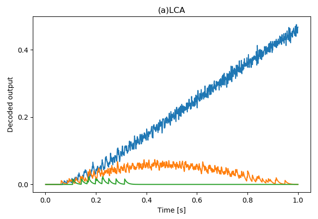

# SNN学习笔记5：LCA

## 稀疏编码

实验表明人脑对于外界刺激采取一种稀疏的内在表示，例如自然图像只需要用[稀疏词典](https://en.wikipedia.org/wiki/Sparse_dictionary_learning)中一个很小的子集及合适的对应系数来进行稀疏近似（sparse approximation）。

### 稀疏近似

稀疏近似的数学表述如下：

​	给定一个N维刺激$s \in \mathbb{R}^N$, 找到一个基于由M个向量$\{\phi_m\}$组成的词典$D$的表示。当词典$D$是overcomplete时（i.e M > N），我们可以有无穷多种方式来选取词典中向量对应的稀疏$\{a_m\}$ 来表示$s$: $s = \sum_{m = 1}^Ma_m\phi_m$。

在最优稀疏近似中，我们希望尽可能少的使用D中的向量，也就是**系数不为0的向量尽可能的少**：
$$
\mathop{min}_a ||a||_0    s.t.    s = \sum_{m = 1}^Ma_m\phi_m
$$
上式中$||a||_0$表示$\ell^0$ norm, 也就是 $a = [a_1, a_2, ..., a_M]$中非零元素的个数。需要注意的是，这个组合优化问题是NP-hard的。

### Basis Pursuit目标

对$\ell_0$的优化是NP-hard的，BP目标函数尝试将优化目标改为最小化系数向量的$\ell_1$ norm：
$$
\mathop{min}_a ||a||_1    s.t.    s = \sum_{m = 1}^Ma_m\phi_m
$$
BP目标函数在信号$s$相对稀疏时也可以得到最优稀疏近似。

### BPDN：重建误差

实际操作中，由于$s$中存在噪音，我们不应该要求完美重建。BPDN（Basis Pursuit De-Noising）目标函数在BP的基础上引入了MSE重建误差来平衡正则项与重建精度：
$$
\mathop{min}_a (||s - \sum_{m = 1}^Ma_m\phi_m||_2^2 + \lambda||a||_1)
$$
公式中的$\lambda$正是用来权衡重建误差与正则项的。

#### MP算法

在信号处理社区，常用MP(Matching Pursuit)算法来求解BPDN。MPs算法本质上是一种贪心算法，流程如下：

1. 将残差初始化为$s$: $r_0 = s$
2. 在第k次迭代，通过$\theta_k = argmax_m|\langle r_{k-1}, \phi_m\rangle|$找到词典M中的索引$\theta_k$
3. 更新残差：$r_k = r_{k - 1} - \phi_{\theta_k}d_k$

K次迭代后得到一个$s$的稀疏近似：$\hat{s} = \sum_{k = 1}^K \phi_{\theta_k}d_k$。

## LCA

[LCA](https://ece.rice.edu/~eld1/papers/Rozell08.pdf)(Locally Competitive Algorithm)是一种稀疏编码算法，相比MP算法，不仅考虑到了选取最稀疏表示的目标，也考虑了选取最能表征信号特性的向量的目标。同时，LCA对随时间变化的信号的处理进行了优化，LCA不用每一步都从头进行稀疏近似，而是基于上一步的表征向量进行更新。

### 框架

LCA中，词典中的每个向量$\phi_m \in D$都被关联到一个神经元。神经元中维护自己的膜电位$u_m(t)$，神经元的输入电流为输入与神经元的感受野的匹配度：$b_m(t) = \langle\phi_m, s(t)\rangle$。当神经元m的膜电位超过阈值$\lambda $时，输出一个激活信号$a_m = T_\lambda(u_m)$并向周边神经元n发射抑制信号$a_mG_{m, n}$其中$ G_{m, n} = \langle \phi_m, \phi_n \rangle$。

NOTE: 从抑制信号的公式中可以看出，一个神经元的激活越强，对周边神经元的抑制越强；一个神经元与周围的神经元越相似，对周围神经元的抑制越强。这种机制会导致匹配度最高的神经元得到最大的电流输入，然后抑制周边神经元得到输入及进行反向抑制，以此达到获取**稀疏表示**的效果（WTA：winner takes all）。

上面的膜电位变化机制可以用下面的常微分方程来描述：
$$
\dot{u}_m(t) = \frac{1}{\tau}[b_m(t) - u_m(t) - \sum_\limits{\substack{n \neq m} }G_{m, n}a_n(t)
$$

### Demo实现

github上的一个[参考实现](https://github.com/ctn-waterloo/cogsci17-decide/blob/5e82b8cf466db5ce84270c866e9dc0c36daa52b6/cogsci17_decide/networks.py)：

```python
import nengo
import numpy as np
import matplotlib.pyplot as plt

def LCA(d, n_neurons, dt):
    k = 1.
    beta = 1.
    tau_model = 0.1
    tau_actual = 0.1

    I = np.eye(d)
    inhibit = 1 - I
    B = 1. / tau_model
    A = (-k * I - beta * inhibit) / tau_model

    with nengo.Network(label="LCA") as net:
        net.input = nengo.Node(size_in=d)
        # array of ensembles: d ensembles, each with n_neurons neurons
        x = nengo.networks.EnsembleArray(
            n_neurons, d,
            eval_points=nengo.dists.Uniform(0., 1.),
            intercepts=nengo.dists.Uniform(0., 1.),
            encoders=nengo.dists.Choice([[1.]]),
            label="state")
        # transform: linear transformation mapping the pre output to the post input
        # synapse: synapse model for filtering
        nengo.Connection(x.output, x.input, transform=tau_actual * A + I, synapse=tau_actual)
        nengo.Connection(net.input, x.input, transform=tau_actual*B, synapse=tau_actual)
        net.output = x.output
    return net

def main():
    dt = 0.001
    with nengo.Network(seed=42) as model:
        # winner takes all
        wta = LCA(3, 200, dt)
        stimulus = nengo.Node([0.8, 0.7, 0.6])
        nengo.Connection(stimulus, wta.input, synapse=True)

        p_stimulus = nengo.Probe(stimulus, synapse=None)
        p_output = nengo.Probe(wta.output, synapse=0.01)
    with nengo.Simulator(model, dt=dt) as sim:
        sim.run(1.)

    fig = plt.figure()
    plt.plot(sim.trange(), sim.data[p_output])
    plt.title("(a)LCA")
    plt.xlabel("Time [s]")
    plt.ylabel("Decoded output")
    plt.locator_params(axis='y', nbins=5)
    plt.tight_layout()
    plt.show()
        

if __name__ == "__main__":
    main()
```

效果如下：



可以看到3个ensemble中只有得到最强输入的一个保留了下来。